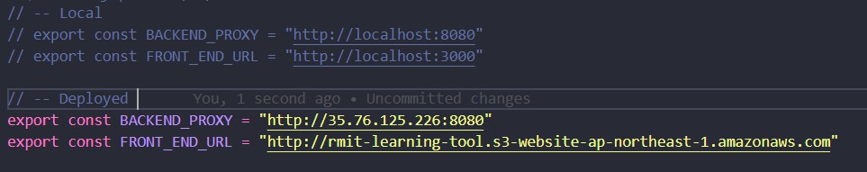
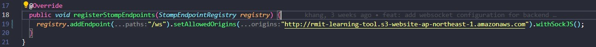

# CodeCrusaders---RMIT-University-Vietnam-Design-for-Learning-tool

RMIT Capstone Project

Technology Development tools:
- Front-end: ReactJS (https://react.dev),
- Back-end: Spring Boot (https://start.spring.io/),
- Database: MySQL (Info: https://www.mysql.com),

- API Testing: Postman (Info: https://www.postman.com/company/about-postman/)

How to set up?
---

- For Database (MySQL):

  - Step 1: Download the MySQL Community Server from website, make sure to choose the approriate operation system
  - Step 2: Download of the software to view the database (MySQL Workbench, DataGrip, DBeaver, etc)
  - Step 3: Create an account with username and password, then make a schema named **database** (Remember the account and password for later steps)

- For Server (Spring Boot):

  - VSCode:
    - Step 1: Download extension called Spring Boot Dashboard from Microsoft - if you download it, go to next step
    - Step 2: Go to application.propeties and change line 8 and 9 with your MySQL account (From Step 2 of setting up Database)
    - Step 3: Open Spring Boot Dashboard
    - Step 4: Run it
  - Intellij:
    - Step 1: Open the project in server folder
    - Step 2: Go to application.propeties and change line 8 and 9 with your MySQL account (From Step 2 of setting up Database)
    - Step 3: Run the application, make sure the MySQL server is on

- For Client (ReactJS):
  - Step 1: Open Terminal
  - Step 2: From the project's root directory, navigate to `path/client` directory - path is where you store this project in specific directory or if you use terminal in VSCode which located in this project just use cd client
    ```bash
    cd path/client
    ```
  - Step 3: Initialize the client
    ```bash
    npm clean-install
    npm add file:./CKEditor5Custom
    ```
    or
    ```bash
    npm ci
    npm add file:./CKEditor5Custom
    ```
  - Step 4: Start the client with development mode
    ```bash
    npm run start
    ```
    Or start the client with production mode if you want to
    ```bash
    npm run production
    ```

Note: 
---
- In the client/src/proxy.js, I have already set up 2 addresses, one for local, one for deploy in AWS or any deployment tools such as Vercel, Azure

If you want to use local part, change it into usable code, else, change into comment one, same with deployed.

```bash
  // --- Local
  export const BACKEND_PROXY = "http://localhost:8080"
  export const FRONT_END_URL = "http://localhost:3000"
```

```bash
  // --- Deployed (AWS - Front-end S3, Back-end EC2, Route53 For HTTPS Protocol)
  export const BACKEND_PROXY = "http://35.76.125.226:8080"
  export const FRONT_END_URL = "http://rmit-learning-tool.s3-website-ap-northeast-1.amazonaws.com"
```

Also, in server/src/main/java/com/example/server/config/WebSocketConfig.java, 

change code in line 19 into code below if you want to use real time comment feature:

```bash
// --- Local 
registry.addEndpoint("/ws").setAllowedOrigins("http://localhost:3000").withSockJS();
```

```bash
// --- Deployed (AWS)
registry.addEndpoint("/ws").setAllowedOrigins("http://rmit-learning-tool.s3-website-ap-northeast-1.amazonaws.com").withSockJS();
```

- Before you start the client, you should start with the database first, server second to avoid unnecessary error related to connection
